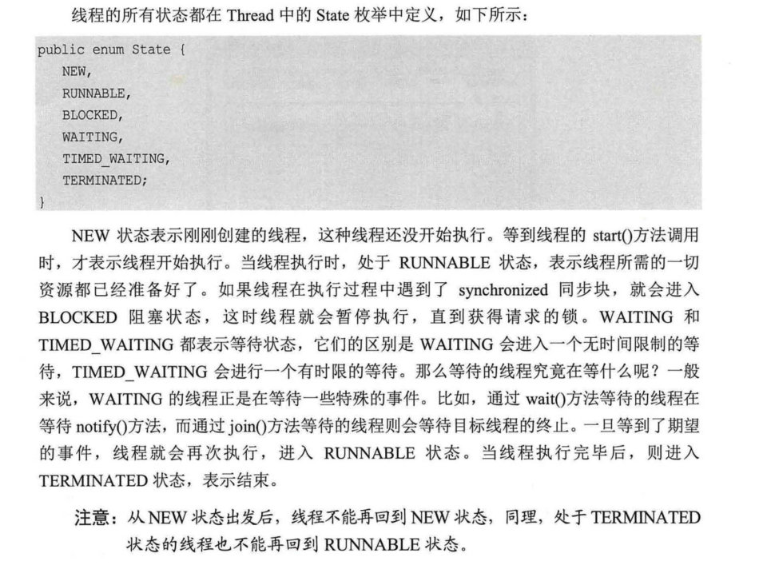

指令重排是有一些规则的，并非所有的指令都能重排

###### Happe  Beffore规则

 + volatile原则,voltitle变量的写优先于读
 + 锁规则: 解锁unlock必须在随后的加锁lock前
 + 传递性 ：A先于B，B先于C，那么A先于C
 + 线程的所有操作先于线程的终结
 + 线程的中断先于被中断的代码
 + 对象的构造执行，先于finzlize()方法
 
 
 